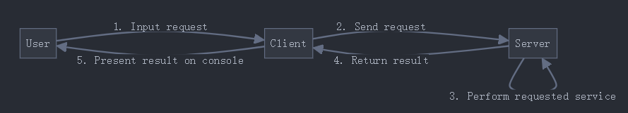

# SC6103_DS

## A Distributed Flight Information System
 - CS Architecture
 - UDP sockets

### Server

#### store the information of all flights
'''
flight:
{
    flight_id: int
    source_place: variable-length str
    destination_place: variable-length str
    departure_time: {
        year
        month
        day
        hour
        minute
    }
    airfare: float
    seat_availability: int // num of seats available
}
'''

#### implement services on the flights for remote access by clients
1. query_flight_id (source_place, destination_place) {
    if multiple flights match:
        return a list of all
    if no flight matches:
        return an error message
}

2. query_departure_time (flight_id)
    query_airfare (flight_id)
    query_seat_availability (flight_id)
    if flight_id does not exist:
        return an error message

3. make_seat_reservation (flight_id, num_seats) {
    if successful reservation:
        return acknowledgement to client
        update seat_availability on server 
    if incorrect user input (flight_id does not exist or insufficient available for num_seats):
        return an error message
}

4. callback (server & client): monitor_seat_availability (main pre content)

5. two more operations on the flights through client-server communication:
    - one idempotent
    - one non-idempotent

6. create a new thread to serve each request received
'''

### Client
1. provide an interface that repeatedly asks the user to enter a request and sends the request to the server
 
2. include an option for the user to terminate the client

3. already know the server address and port number

### Message
1. self-design format
2. transmit in byte array
 - marshaling (int / float / str)
 - unmarshalling

 #include <netinet/in.h>
 uint32_t htonl(uint32_t hostlong);
 uint32_t ntohl(uint32_t netlong);