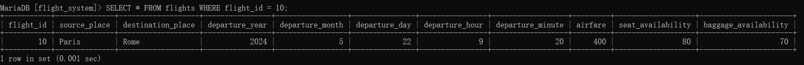
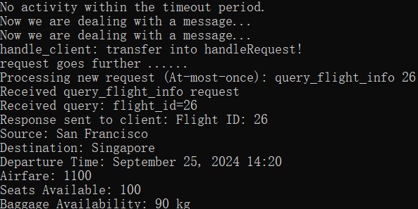
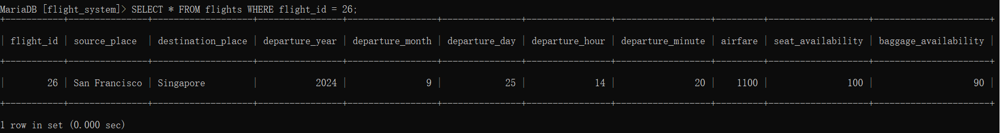
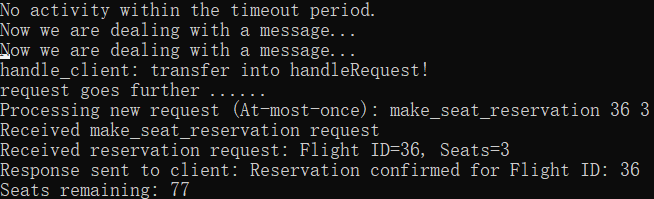
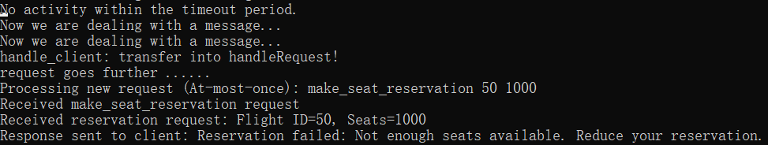
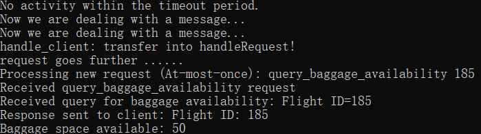
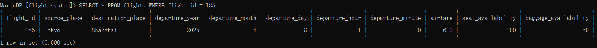
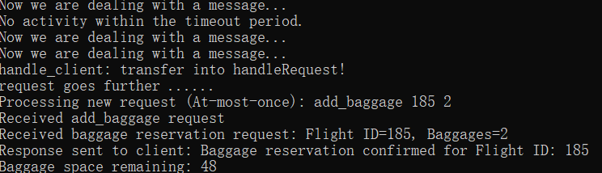
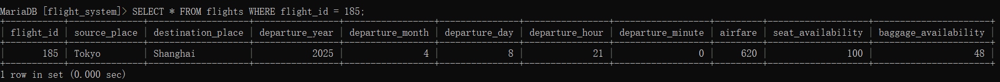

## quiry_flight_id
### Singapore to Shanghai

### London to Beijing

## query_flight_info 
### flight_id=10

### flight_id=26

### make seats reservation

exceed:

185:

add baggage 88
before

